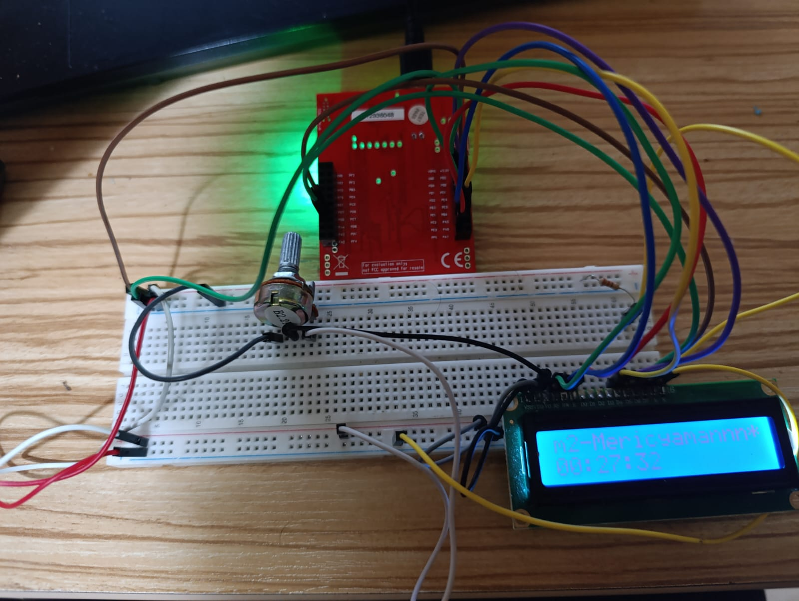

# 02 – LCD Clock Application  
*(Software-Based Timer Clock Extension)*

---

## Overview

This project extends **Project-01 (16x2 LCD Driver)** by implementing a **software-based digital clock** using the **Timer0 peripheral** of the Tiva C microcontroller.

Unlike a real-time clock (RTC) module, this project does **not** use external hardware such as DS1307 or DS3231.  
Time is generated entirely in software using periodic timer interrupts.

---

## System Overview

The system uses:

- Timer0 interrupt (1-second period)  
- Software counters for hours, minutes, and seconds  
- LCD update logic separated from interrupt execution  

Time accuracy depends on the system clock configuration and may drift over long durations.

---

## What’s New Compared to Project-01

### 1. Software-Based Timekeeping

A new timing system is implemented using **Timer0**.

```c
volatile uint8_t saat;
volatile uint8_t dakika;
volatile uint8_t saniye;
```

These variables are updated once per second inside the Timer0 interrupt service routine.

---

### 2. Timer0 Interrupt (ISR)

```c
void Timer0_ISR(void)
```

**Responsibilities:**
- Triggered every 1 second  
- Increments time values  
- Handles overflow logic:
  - `59 → 0` seconds → minute++
  - `59 → 0` minutes → hour++
  - `23 → 0` hours  
- Sets a flag to request LCD refresh  

```c
lcd_guncelle = true;
```

LCD is **not updated inside the ISR**, ensuring safe and efficient execution.

---

### 3. Timer Configuration (`Timer0_Init()`)

```c
TimerConfigure(TIMER0_BASE, TIMER_CFG_A_PERIODIC);
TimerLoadSet(TIMER0_BASE, TIMER_A, SysCtlClockGet());
```

- Timer0 configured in periodic mode  
- Load value corresponds to a 1-second interval  
- Interrupts are enabled and registered properly  

---

### 4. LCD Update Logic (`LCD_SaatGoster()`)

```c
if (!lcd_guncelle) return;
```

- LCD updates only when required  
- Prevents unnecessary screen refresh  
- Displays time in `HH:MM:SS` format  

```c
sprintf(saat_buffer, "%02u:%02u:%02u", saat, dakika, saniye);
```

Output appears on the **second row** of the LCD.

---

### 5. Manual Time Adjustment Support

```c
void Timer_SetTime(uint8_t h, uint8_t m, uint8_t s)
```

- Allows external time setting (UART, buttons, etc.)
- Validates input range
- Forces LCD refresh after update

---

## Changes in LCD Driver (Compared to Project-01)

### Function Naming Improvement

- `printf()` → `LCD_print()`  
  Avoids conflict with standard C library and improves clarity.

### Minor Improvements

- More stable initialization delays  
- Cleaner function naming consistency  
- No change to pin mapping or 4-bit data protocol  

---

## Updated main.c Flow

```c
Tiva_init();
LCD_init();
LCD_clear();
Timer0_Init();

LCD_setcursorPosition(1, 1);
LCD_print("m2-Mericyamannn*");

while(1)
{
    LCD_SaatGoster();
}
```

---

## Example LCD Output

```
m2-Mericyamannn*
12:34:56
```

---

## Files Added / Modified

| File     | Description                              |
|----------|------------------------------------------|
| timer.c  | Timer0 configuration and time logic      |
| timer.h  | Timer interface definitions              |
| main.c   | Integrates timer and LCD logic            |
| lcd.c    | Minor improvements for compatibility     |
| lcd.h    | Updated function naming                  |

---

## Summary

This project demonstrates:

- Timer-based software clock implementation  
- Interrupt-driven time updates  
- Clean separation between ISR logic and display logic  
- Extendable architecture for future RTC or button integration  

