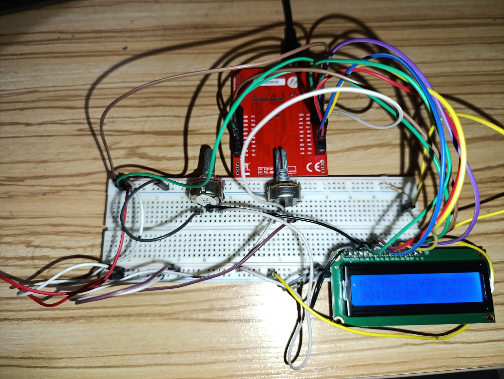

# 03 – LCD ADC Voltage Monitor  
*(ADC + LCD + Timer Integration Project)*

---

## Overview

This project extends the previous LCD Clock application by integrating **ADC (Analog-to-Digital Converter)** functionality.  
The system now reads an **analog voltage from a potentiometer**, converts it using the **ADC0 peripheral**, and displays the measured voltage on the LCD in real time.

This project combines:
- LCD driver (Project-01)
- Software-based clock (Project-02)
- ADC measurement and voltage visualization (NEW)

---

## New Features in This Project

### 1. ADC Input Support (NEW)

An analog signal is read from:
- **ADC0 Channel 9**
- Physical pin: **PE4**

The ADC converts the analog voltage (0–3.3V) into a 12-bit digital value (0–4095).

---

### 2. ADC Initialization (`ADC_Init()`)

```c
void ADC_Init(void)
```

- Enables ADC0 and GPIOE peripherals  
- Configures **PE4** as ADC input  
- Uses **Sequencer 3** for single-sample conversion  
- Software-triggered ADC sampling  

---

### 3. Raw ADC Reading (`ADC_ReadRaw()`)

```c
uint16_t ADC_ReadRaw(void)
```

- Triggers ADC conversion
- Waits until conversion is complete
- Reads raw 12-bit ADC value
- Returns value between **0–4095**

---

### 4. Voltage Conversion (`ADC_ReadVoltage()`)

```c
float ADC_ReadVoltage(void)
```

Converts raw ADC value into voltage using:

```
Voltage = (ADC_Value × 3.3) / 4095
```

---

### 5. LCD Voltage Display (`LCD_ADC_Goster()`)

```c
void LCD_ADC_Goster(uint8_t row, uint8_t col)
```

- Reads ADC value
- Converts it to millivolts
- Formats output as: `X.XXV`
- Displays voltage on LCD at selected position

---

## LCD + ADC Integration Flow

```c
while(1)
{
    LCD_SaatGoster();
    LCD_ADC_Goster(2, 10);
}
```

- Clock displayed on row 1  
- ADC voltage displayed on row 2  

---

## ADC Configuration Summary

| Parameter | Value |
|---------|--------|
| ADC Module | ADC0 |
| Channel | CH9 |
| GPIO Pin | PE4 |
| Resolution | 12-bit |
| Reference Voltage | 3.3V |
| Trigger Type | Software |
| Sequencer | SS3 |

---
### Pin Schematic 

## File Structure

```
03_LCD_ADC_Display/
│
├── adc.c        → ADC initialization & voltage reading
├── adc.h        → ADC interface
├── timer.c      → Software clock logic
├── timer.h      → Timer interface
├── lcd.c        → LCD driver
├── lcd.h        → LCD definitions
└── main.c       → System integration
```

---

## Example LCD Output

```
m2-Mericyamannn*
12:34:56   2.48V
```

---

## Summary

This project demonstrates:

- ADC sampling with Tiva C  
- Real-time voltage monitoring  
- LCD + Timer integration  
- Modular embedded system design  

---

## Notes

- ADC reference voltage assumed as 3.3V  
- Accuracy depends on supply stability  
- Designed for educational use  

---

📌 **This project builds directly on Project-01 and Project-02.**


