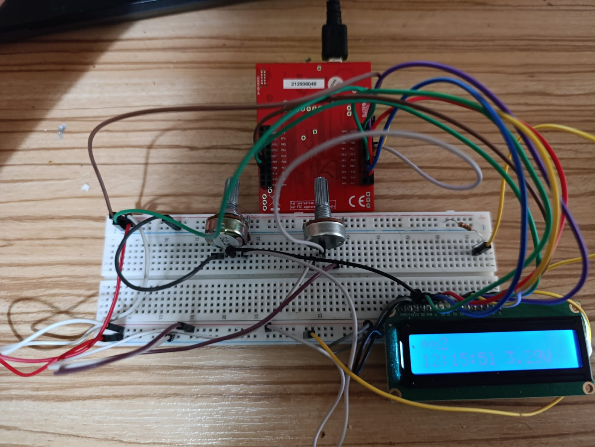

# 04 – LCD + ADC + UART Integrated System  
*(Tiva C Embedded Systems Project)*

---

## 📌 Overview

This project is the **fourth stage** of the Tiva C LCD project series.  
It integrates **LCD display**, **ADC voltage measurement**, **Timer-based clock**, and **UART communication** into a single cohesive embedded system.

The system is designed to:
- Display real-time clock information
- Read analog voltage via ADC
- Display voltage on LCD
- Communicate with a PC over UART
- React to button presses and serial commands

---


## 🧩 Modules Overview

| Module | Description |
|------|-------------|
| `lcd.c / lcd.h` | LCD driver (4-bit mode) |
| `timer.c / timer.h` | Software clock using Timer0 |
| `adc.c / adc.h` | ADC sampling and voltage conversion |
| `uart.c / uart.h` | UART communication & command parsing |
| `main.c` | System integration and main loop |

---

## 🕒 Time Management (Timer0)

- Timer0 configured in **periodic mode**
- Interrupt fires every **1 second**
- Updates `saat`, `dakika`, `saniye`
- LCD update triggered via software flag

```c
void Timer0_ISR(void);
```

---

## 🔌 ADC Measurement

- ADC0 Channel 9 (PE4)
- 12-bit resolution (0–4095)
- Converted to voltage using:

```
Voltage = (ADC_Value × 3.3) / 4095
```

Displayed as:

```
X.XXV
```

---

## 🖥 LCD Display Layout

```
m2-Mericyamannn*
12:34:56   2.48V
```

- Line 1: Static text or UART text
- Line 2: Clock + ADC voltage

---

## 🔄 UART Communication

### Supported Commands

| Command | Description |
|------|-------------|
| `<ABC>` | Displays `ABC` on LCD |
| `!12:34:56` | Sets system time |
| Button press | Sends `B1` to PC |
| Periodic TX | Sends ADC & time data |

---

## 🧠 Main Loop Logic

```c
while(1)
{
    UART_ProcessRX();
    LCD_SaatGoster();
    LCD_ADC_Goster(2, 10);
}
```

- Non-blocking
- Interrupt-driven
- Clean separation of concerns

---

## 📂 File Structure

```
04_LCD_ADC_UART/
│
├── adc.c / adc.h
├── lcd.c / lcd.h
├── timer.c / timer.h
├── uart.c / uart.h
└── main.c
```

---

## ⚙️ Hardware Connections

| Peripheral | Pin |
|----------|------|
| ADC (CH9) | PE4 |
| UART TX  | PA1 |
| UART RX  | PA0 |
| LCD RS   | PE1 |
| LCD RW   | PE2 |
| LCD EN   | PE3 |
| LCD D4–D7 | PB4–PB7 |
| Button   | PF4 |

---

## 🚀 Features Summary

- Modular driver structure  
- Interrupt-based timing  
- UART command interface  
- ADC voltage monitoring  
- Expandable architecture  

---

## 🧪 Future Improvements

- EEPROM data logging  
- RTC module integration  
- UART command parser enhancements  
- LCD menu system  

---

## ✅ Summary

This project demonstrates a **complete embedded system** combining:
- GPIO
- ADC
- Timer
- UART
- LCD display

All modules are designed to be **clean, reusable, and extensible**.

---

📁 **This project builds upon Project-01, Project-02, and Project-03.**
